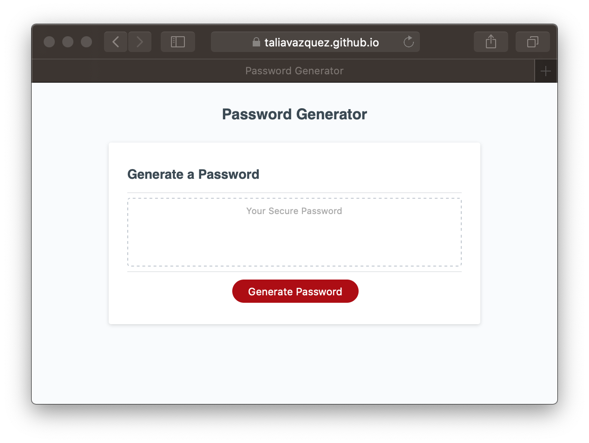

The following image shows the code generator.

# Project Title

Password Generator

## Motivation

This password generator was created to generate quick passwords.

## Style

Standard style was used in this code.

## How to use?

Use this code to build a very simple password generator. Use the Website to build a password with the length you wish.

## Credits

Shout out to my Study Group, Google, <a href="https://validator.w3.org/">Validator</a>, <a href="www.w3schools.com/">W3</a>, <a href=" https://developer.mozilla.org/en-US/docs/Learn/JavaScript/First_steps/What_is_JavaScript">Mozilla</a> 

## Project GitHub Repo

<a href="https://github.com/taliavazquez/hw-03"><bold>My GitHub</bold></a>

## Project Website

<a href="https://github.com/taliavazquez/hw-03"><bold>DEMPLOY THE SITE</bold></a>

© 2020 Talia Vazquez
